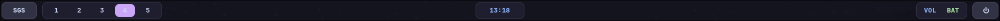

# Segfault's Gtk Shell
---
## A customizable Gtk shell for Hyprland (more compositors soon)

## Dependencies:
- Rust
- Hyprland
- Gtk4

## Build:
- `cargo build --bin sgs`

## Example configs:
### Retro:

#### Install:
- `chmod +x sgs/retro/install.sh && ./sgs/retro/install.sh`
### Modern:

#### Install:
- `chmod +x sgs/modern/install.sh && ./sgs/modern/install.sh`
